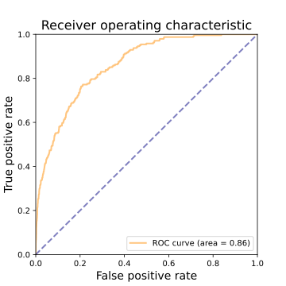
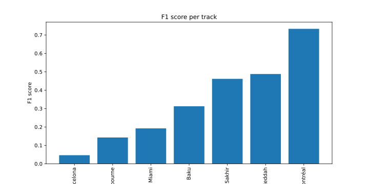
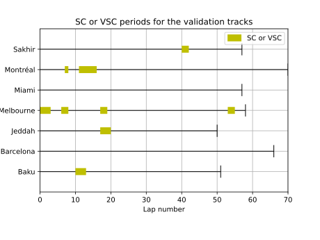
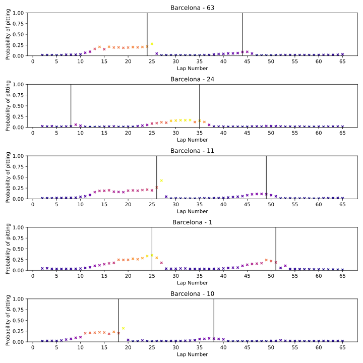
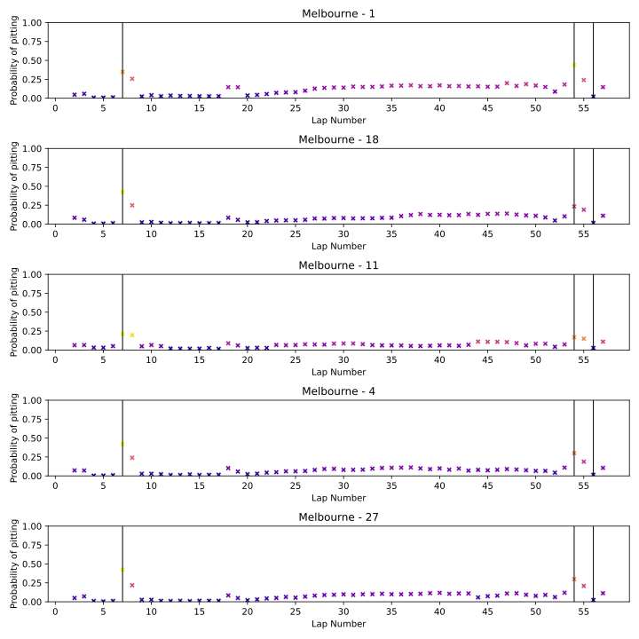
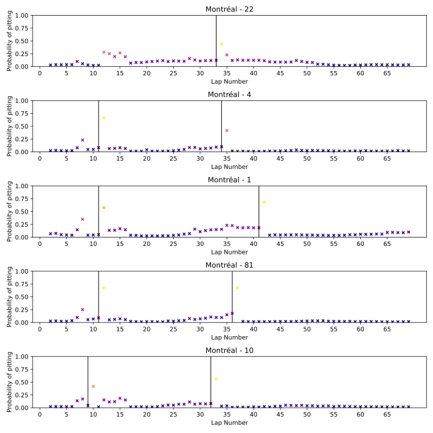
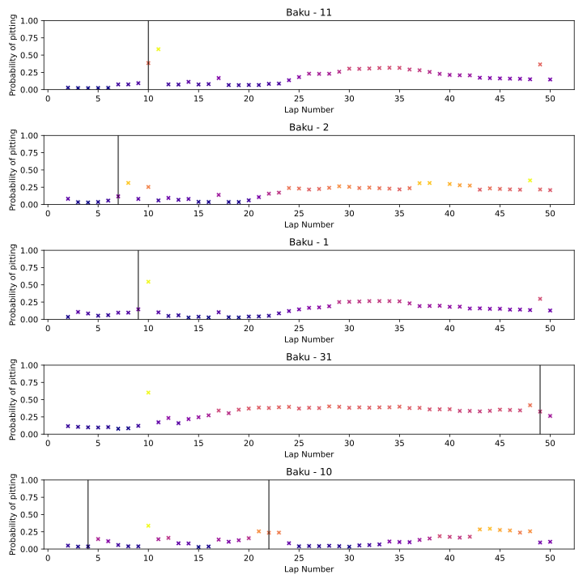
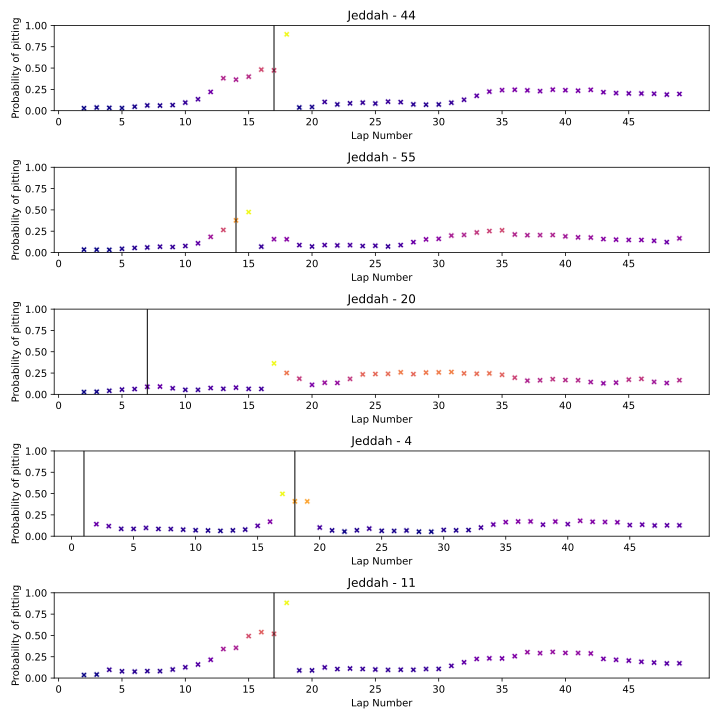
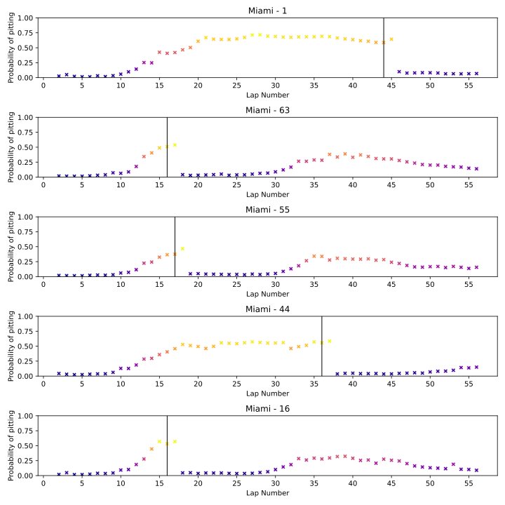
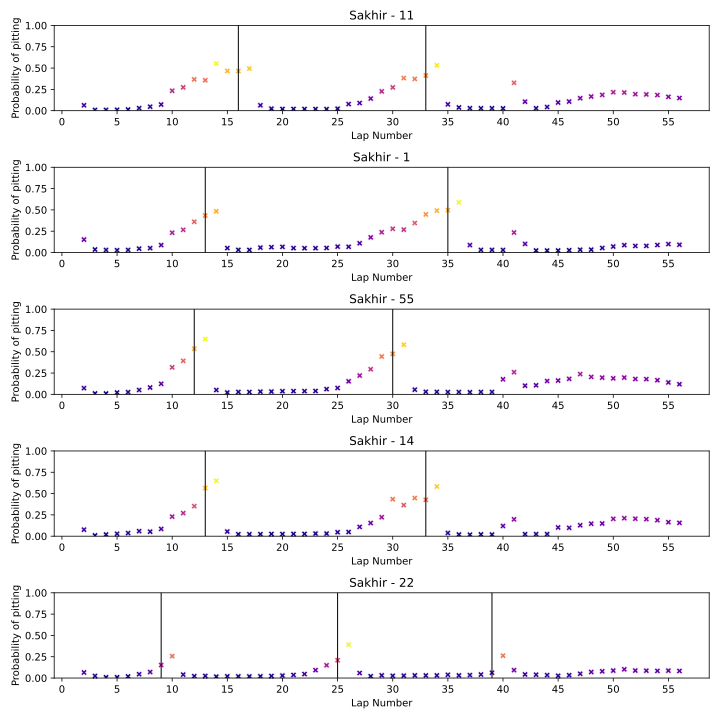

#roc_auc model
Modèle RandomForestClassifier avec les paramètres suivants :
```python
score : 0.9158266044281819
params : {'class_weight': 'balanced_subsample', 'max_depth': 20, 'min_samples_leaf': 5, 'min_samples_split': 2, 'n_estimators': 1000}
```

Trouvé avec GridSearchCV sur les paramètres suivants :
```python
param_grid = {
    'n_estimators': [100, 500, 1000],
    'max_depth': [5, 10, 20],
    'min_samples_split': [2, 5, 10],
    'min_samples_leaf': [1, 2, 5],
    'class_weight': ['balanced_subsample']
}
```

Résultats sur le jeu de données de test :
```python
[[15329   478]
 [  238   254]]
              precision    recall  f1-score   support

       False       0.98      0.97      0.98     15807
        True       0.35      0.52      0.42       492

    accuracy                           0.96     16299
   macro avg       0.67      0.74      0.70     16299
weighted avg       0.97      0.96      0.96     16299
```
Résultats sur le jeu de données de validation (7 courses de 2023):
```python
[[6806  145]
 [ 121   76]]
              precision    recall  f1-score   support

       False       0.98      0.98      0.98      6951
        True       0.34      0.39      0.36       197

    accuracy                           0.96      7148
   macro avg       0.66      0.68      0.67      7148
weighted avg       0.96      0.96      0.96      7148
```

On observe que les performances sont similaire sur le jeu de données de test et de validation. On peut donc conclure que le modèle ne souffre pas d'overfitting.
## ROC curve

## Performance course par course

On peut voir que les performances sont très variables d'une course à l'autre. Parce que les courses n'ont pas la même difficulté...

### Barcelone

### Melbourne

### Montreal

### Baku

### Jeddah

### Miami

### Sakhir
