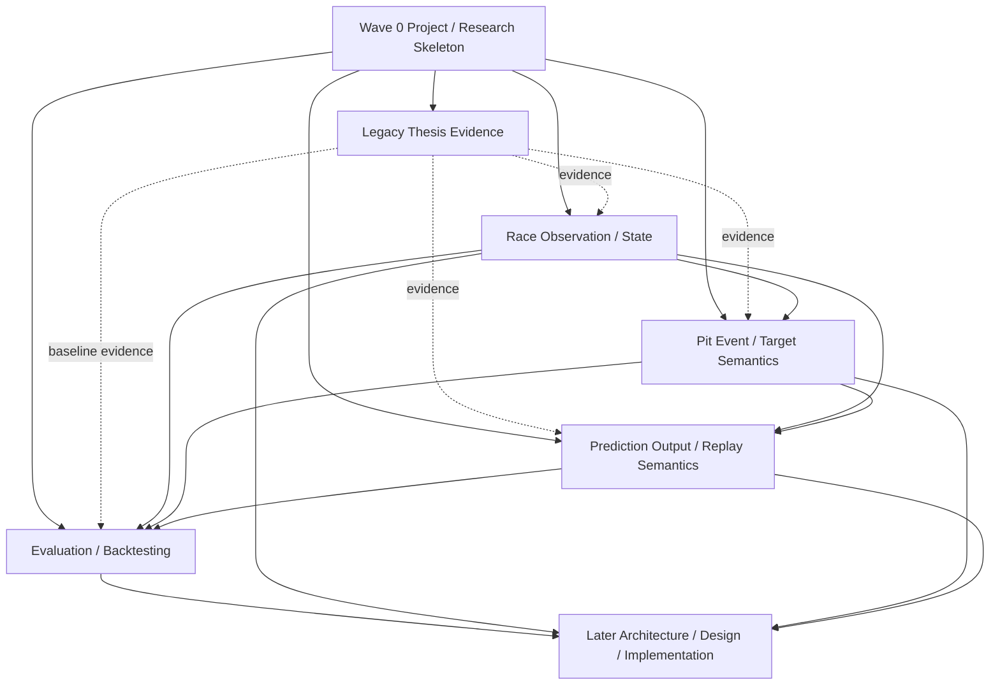

# V2 Semantic Ownership Map

## Status

Draft — structurally usable for Wave 1 planning; final Wave 0 approval remains blocked by the Product Owner direction recorded in the product artifacts.

## Abstraction level

Wave 0 — semantic ownership and dependency direction only. This is not software architecture.

## Ownership principle

Each semantic question has one canonical owning slice. Other slices consume its contract or result rather than redefining it.

Thesis-era behavior is evidence only and does not override approved V2 semantics.

## Initial bounded slices

### 1. Legacy Thesis Evidence

Owns:

- concise factual account of the thesis-era prediction problem and workflow;
- evidence from thesis-era notebooks/data and historical branches;
- legacy baseline assumptions, limitations, and terminology worth carrying forward or explicitly rejecting.

Does not own:

- V2 observation rules;
- V2 target meaning;
- V2 output semantics;
- V2 evaluation semantics.

### 2. Race Observation / State

Owns:

- what a prediction point means in race progression;
- what information is legitimately available at that moment;
- point-in-time state semantics and leakage boundary;
- identities/time notions needed to describe a race observation.

Provides the observation/state contract consumed by downstream semantic slices.

### 3. Pit Event / Target Semantics

Owns:

- what counts as the relevant pit event;
- how a future pit event relates to a prediction point;
- target/event lifecycle semantics;
- censoring/eligibility semantics at the domain level.

Consumes the Race Observation / State contract rather than redefining prediction-time availability.

### 4. Prediction Output / Replay Semantics

Owns:

- what a V2 prediction communicates to a consumer;
- conceptual pit-window / future-lap likelihood semantics after Product Owner direction is approved;
- replay interpretation and update semantics;
- relationship between output and the target/event contract.

Consumes Race Observation / State and Pit Event / Target semantics.

### 5. Evaluation / Backtesting

Owns:

- what constitutes a valid historical replay/backtest;
- evaluation units and comparison semantics;
- leakage-safe evaluation guarantees;
- how approved output semantics are judged against approved event/target semantics.

Consumes the observation, event/target, and output contracts. It does not redefine them.

## Later-phase ownership

### Architecture / Data / Model / Implementation

Later work owns technical structure, schemas, features, model formulation, pipelines, APIs, storage, runtime, UI technology, live-data integration, and implementation.

It consumes approved semantic artifacts and may not silently change them.

## Dependency direction

Dotted edges carry historical evidence, not semantic authority.

## Cross-slice contracts required before integration

| Provider | Consumer(s) | Required contract at semantic level |
| --- | --- | --- |
| Race Observation / State | Target, Output, Evaluation | prediction-point meaning and legitimate information boundary |
| Pit Event / Target Semantics | Output, Evaluation | event identity, relation to prediction point, eligibility/censoring meaning |
| Prediction Output / Replay Semantics | Evaluation | meaning of the prediction that evaluation must score/interpret |
| Legacy Thesis Evidence | all Wave 1 slices as useful | factual baseline/evidence only; no normative V2 authority |

## Wave 1 launch shape

Once Wave 0 is approved, the five slices above can be issued as bounded work packages. Legacy evidence may proceed independently. Race Observation / State should establish the first semantic contract needed by the other prediction slices. Pit Event / Target may analyze its internal concepts in parallel where they do not depend on unresolved observation timing. Output and Evaluation must not invent missing upstream semantics.

## Unknown routing

| Question | Classification | Owner / next artifact | Status |
| --- | --- | --- | --- |
| Whether the proposed project direction is approved | Current-scope | Product Owner / Wave 0 product artifacts | Blocking Wave 0 approval |
| Exact observation timing/information | Cross-slice | Race Observation / State | Wave 1 |
| Exact target/censoring | Cross-slice | Pit Event / Target Semantics | Wave 1 |
| Exact pit-window representation/horizon | Cross-slice | Prediction Output / Replay Semantics | Wave 1 |
| Exact evaluation protocol | Cross-slice | Evaluation / Backtesting | Wave 1 |
| Technical contracts/components | Later-phase | Architecture / design | Deferred |
