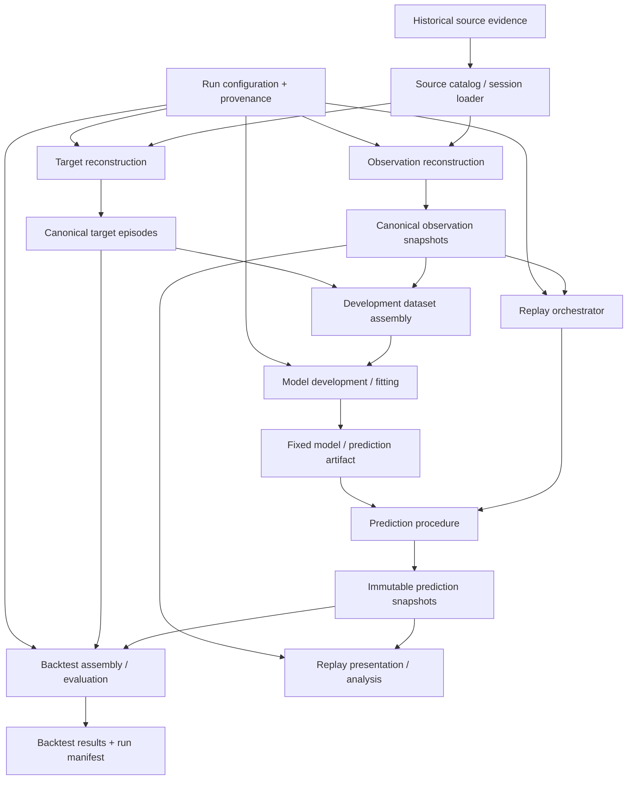

# V2 System Architecture Baseline

## Status

Draft — Issue #17, branch `design/system-architecture-baseline`.

## Abstraction level

Architecture — component boundaries, dependency direction, execution flow, artifact responsibilities, and reproducibility boundaries.

This artifact does not define provider-field reconstruction rules, exact data schemas, target-reconstruction algorithms, feature sets, model families, probability-region parameterization, metrics, production services, or live inference.

## Outcome

V2 will start as an **offline, replay-first modular Python system** built around immutable artifacts and explicit run provenance.

The architecture has two deliberately separated evidence paths:

1. a **prediction-time path** that reconstructs only what was legitimately knowable at a canonical observation instant and produces an immutable prediction snapshot; and
2. a **retrospective-truth path** that reconstructs target episodes from eventual race evidence and may be joined to predictions only for development or evaluation under declared temporal rules.

Historical replay/backtesting orchestrates these paths. Target truth is never an input to observation reconstruction or to prediction generation for the observation being forecast.

## Upstream semantic locks

This architecture consumes and does not redefine:

- `contexts/RACE_OBSERVATION_STATE.md` — canonical start/lap-completion checkpoints, prediction instant, availability-time information boundary, immutable as-of state, and race-wide time alignment;
- `contexts/PIT_EVENT_TARGET.md` — tyre-service-only qualifying event, pit-lane-entry occurrence anchor, first qualifying event strictly after prediction instant, target eligibility, terminal no-event, and truncation;
- `contexts/PREDICTION_OUTPUT_REPLAY.md` — complete remaining-target-scope probability distribution, explicit terminal no-event probability, derived pit-window summary, and immutable successive prediction snapshots;
- `contexts/EVALUATION_BACKTESTING.md` — one prediction-target pair as the atomic evaluation unit, leakage-safe replay/backtesting, repeated-within-race forecast identity, and separation between development evidence and final backtest evidence;
- `contexts/WAVE1_SEMANTIC_INTEGRATION.md` — the passing semantic integration gate and its later-phase handoffs;
- `decisions/2026-09-08-v2-project-direction.md` — predictive rather than prescriptive scope, replay/backtesting first, live inference later;
- `decisions/2026-09-08-v2-pit-event-scope.md` and `decisions/2026-09-09-v2-prediction-output-semantics.md`.

## Repository baseline

The current repository is primarily a thesis-era research repository: historical race CSV files under `data/` plus Jupyter notebooks for collection, EDA, feature work, model training, reporting, and strategy experiments. There is no V2 reusable package, run boundary, or canonical artifact/provenance layer yet.

V2 therefore should not begin by turning existing notebooks into a production service. Existing notebooks and CSVs remain evidence and exploratory inputs. The first implementation architecture should make the canonical semantics executable in reusable modules, then let notebooks call those modules for analysis and visualization.

## Architectural drivers

The initial architecture is driven by the following constraints:

1. **Point-in-time causality is structural.** It must be difficult for future race truth to enter a prediction accidentally.
2. **Replay is the first runtime.** The initial system executes historical sessions chronologically; it is not a live event platform.
3. **Predictions are immutable historical objects.** Rerunning later code produces a new run, not a rewritten earlier forecast.
4. **Targets are retrospective truth.** Target construction may use eventual evidence but is isolated from the prediction-time path.
5. **One observation produces one prediction episode when target-eligible.** Successive observations stay distinct even when they later resolve to the same eventual pit event.
6. **Reproducibility is explicit.** Important state must be carried by artifacts and run manifests, not hidden in notebook cells or process memory.
7. **Detailed choices remain owned by bounded follow-on design.** The architecture supplies stable seams for #18–#21 rather than pre-solving them here.

## Architecture style

### Initial style: modular package + batch orchestration

The initial V2 system should be implemented as one installable Python package with strict internal module boundaries, invoked by a small command-line/batch orchestration layer. Notebooks are consumers of that package, not owners of canonical logic.

This is intentionally simpler than a service-oriented architecture. The initial workload is historical reconstruction, model development, deterministic replay, and backtesting in one research repository. Databases, message brokers, web services, background workers, and distributed runtime components add failure modes without solving a current requirement.

Logical boundaries are nevertheless explicit so a later live extension can replace the source/orchestration edge without changing the observation, prediction, or artifact contracts.

### Persistence style: immutable file artifacts

The architecture requires immutable, run-addressable persisted artifacts and manifests. It does not require a database for the initial core.

Exact serialization formats, column types, directory naming, and partitioning are owned by the detailed design slices. Implementations may use tabular or structured files appropriate to each artifact, provided artifact identity, version, immutability, and provenance requirements below are preserved.

## End-to-end data flow



The diagram contains two important joins:

- Observation and target artifacts may be joined for **development/training** only under the declared development temporal boundary.
- Prediction and target artifacts may be joined for **evaluation** only after the prediction snapshot is fixed.

There is no target-to-observation or target-to-prediction edge in the forecast execution path. The replay orchestrator passes each ordered observation to the prediction procedure; it does not produce the prediction independently.

## Logical components and responsibilities

### 1. Source catalog / session loader

**Owns:** locating and loading the historical evidence selected for one declared reconstruction run, plus source-level identity/checksum/version references.

**Provides:** source evidence to the observation and target reconstruction components.

**Does not own:** semantic interpretation of availability time, pit qualification, target state, model features, or evaluation.

The loader must expose source evidence without silently converting final historical records into prediction-time facts.

Detailed provider/source behavior belongs to #18 and #19.

### 2. Shared identity and provenance primitives

**Owns:** cross-component technical identity/value concepts that must be referenced consistently, such as race-session identity, driver-entry identity, checkpoint/prediction-instant reference, artifact identity, run identity, and version/provenance references.

**Provides:** stable identifiers and provenance references used by all artifact contracts.

**Does not own:** domain semantics already assigned to the Wave 1 slices or the exact storage schema selected later.

This shared layer contains no feature logic and no target-dependent convenience helpers.

### 3. Observation reconstruction

**Owns:** creating canonical driver-specific point-in-time observation snapshots from historical source evidence under the approved availability-time boundary.

**Input:** source evidence + reconstruction configuration.

**Output:** immutable canonical observation snapshots plus reconstruction/provenance status.

**Hard boundary:** this component must not consume target episodes, eventual pit-event qualification, final prediction outcomes, or any later race truth unless that information is independently proven to have been available by the observation prediction instant.

Detailed reconstruction rules, source ordering, ambiguity policy, technical identities, and observation representation belong to #18.

### 4. Target reconstruction

**Owns:** reconstructing the target episode attached to a target-eligible canonical observation using retrospective race evidence.

**Input:** canonical observation identity/boundary + retrospective source evidence + target-reconstruction configuration.

**Output:** immutable target episode in one of the canonical technical outcome states later defined by #19.

**Hard boundary:** target reconstruction may use eventual race truth to establish event qualification and outcome, but it must never mutate or enrich the observation snapshot from which the prediction was produced.

Detailed pit-visit identity, tyre-service qualification, terminal-boundary reconstruction, truncation handling, and target representation belong to #19.

### 5. Development dataset assembly

**Owns:** joining approved observation-derived predictor inputs with canonical target episodes for model development under an explicitly declared development/training population and temporal boundary.

**Input:** immutable observation artifacts, immutable resolved/accounted target artifacts, and development-run configuration.

**Output:** a reproducible model-development dataset/view plus provenance linking back to its source artifacts.

**Hard boundary:** this component is not used to generate a forecast for an evaluation observation. It cannot make target truth available through the prediction procedure's runtime input interface.

Feature selection, transformations, sampling, model family, and statistical choices remain later experimentation/verification work unless a later design issue explicitly owns them.

### 6. Prediction procedure

**Owns:** the stable forecast-time interface that maps one legitimate observation-derived input state plus one fixed prediction/model artifact to one canonical prediction snapshot.

**Input:** one canonical observation, a fixed prediction/model artifact, and prediction configuration permitted by the approved semantics.

**Output:** one immutable complete next-pit probability prediction attached to that observation/target-episode identity when eligible.

**Forbidden input:** the target outcome for the observation being predicted, eventual pit-event identity, future race facts, or evaluation result.

The exact timing-region representation, normalization invariants, model-facing interface, model artifact contract, and pit-window derivation belong to #20.

### 7. Model development / fitting

**Owns:** producing a versioned model/prediction artifact from development evidence permitted by a declared temporal development boundary.

**Input:** development dataset/view + model-development configuration.

**Output:** immutable model/prediction artifact with provenance sufficient to establish which historical evidence and configuration could influence it.

The architecture intentionally separates this component from `Prediction procedure`: training can see historical targets from its allowed development set; forecast execution for a given observation cannot.

Exact estimator family, features, loss, tuning, and calibration remain outside #17.

### 8. Replay orchestrator

**Owns:** deterministic chronological execution over canonical observations for a declared historical session/run, invoking the fixed prediction procedure at the canonical checkpoints and preserving every resulting prediction snapshot.

**Input:** ordered canonical observation artifacts, a fixed prediction/model artifact, replay configuration, and run provenance.

**Output:** immutable prediction snapshots plus a replay run manifest/reference set.

The orchestrator coordinates; it does not reconstruct target truth, change observation state, choose model features, or score predictions.

Detailed replay ordering, run metadata, and execution contract belong to #21.

### 9. Backtest assembly / evaluation boundary

**Owns:** joining already-fixed prediction snapshots to the canonical target episodes that retrospectively resolve them, forming the canonical per-prediction-target evaluation units and passing them to later metric/statistical evaluation logic.

**Input:** immutable prediction snapshots, immutable target episodes, and declared backtest protocol/run configuration.

**Output:** evaluation units, accounting summaries, and versioned backtest result artifacts.

**Hard boundary:** no target or evaluation result may flow backward to change the predictions being evaluated. If evaluation causes the prediction-producing procedure to change, a later run must use a new model/procedure/run identity and new final-evaluation evidence under the approved temporal rules.

Detailed temporal development/evaluation mechanics and accounting belong to #21. Exact scoring/statistical estimators remain verification/statistical-design work.

### 10. Replay presentation / notebooks

**Owns:** human-facing exploration, plots, diagnostics, and replay presentation built from canonical artifacts.

**Input:** observation, prediction, target, and result artifacts as appropriate to the analysis being shown.

**Does not own:** canonical reconstruction, target, prediction, or evaluation logic.

Existing thesis-era notebooks remain historical evidence. New or revised notebooks may consume V2 modules, but a result is not reproducible merely because a notebook once produced it.

## Dependency rules

The implementation must preserve the following directional rules even if physical modules are later reorganized:

1. Shared identity/provenance primitives may be imported by all V2 modules but must not depend on reconstruction, prediction, or evaluation modules.
2. Observation reconstruction may depend on source loading and shared primitives only; it must not depend on target, model-development, prediction-output, or evaluation modules.
3. Target reconstruction may consume the observation identity/prediction boundary and source evidence; it must not alter observation artifacts.
4. Prediction execution may consume observation-derived state and a fixed model/prediction artifact; it must not import or query target outcomes for the observation being forecast.
5. Development assembly is the explicit controlled join where historical observation inputs and allowed training targets meet.
6. Backtest assembly is the explicit controlled join where immutable predictions and retrospective target outcomes meet.
7. Replay orchestration coordinates prediction execution but must not become a hidden feature/target reconstruction layer.
8. Presentation/notebook code may depend on public V2 interfaces; canonical V2 modules must not depend on notebooks.
9. No architecture component may reinterpret a high pit probability as an optimal strategy recommendation.

A useful implementation rule is that target reconstruction and evaluation packages are absent from the dependency closure of the forecast-time prediction entry point.

## Artifact classes and ownership

The architecture requires the following logical persisted artifacts. Exact schemas and serialization are deferred.

| Artifact | Created by | Primary consumers | Mutability rule |
| --- | --- | --- | --- |
| Source evidence manifest | Source catalog / loader | Reconstruction, audit | Immutable for a declared source snapshot/run |
| Canonical observation snapshot | Observation reconstruction | Prediction, replay, development, audit | Immutable as-of state |
| Target episode | Target reconstruction | Development, backtest, audit | Immutable for a declared reconstruction/version; corrections create a new reconstruction artifact/version |
| Model / prediction artifact | Model development | Prediction, replay | Immutable version used by a run |
| Prediction snapshot | Prediction procedure / replay | Replay presentation, backtest, audit | Immutable historical forecast |
| Replay run manifest | Replay orchestrator | Audit, presentation, backtest linkage | Immutable after run completion |
| Backtest run manifest/results | Backtest boundary/evaluator | Analysis, reporting, audit | Immutable after run completion |

“Immutable” means a historical artifact used by a declared run is not silently overwritten. Improved source reconstruction, code, model, or configuration creates a new version/run with lineage to its predecessors.

## Provenance boundary

Every persisted V2 run/artifact must be traceable enough to answer, as applicable:

- which repository/code revision produced it;
- which approved semantic/design version it claims to implement;
- which source evidence snapshot(s) and source identity/version/checksum references were used;
- which reconstruction configuration/version produced the observation or target artifact;
- which model/prediction artifact and model-development provenance produced a prediction;
- which replay/backtest run configuration was active;
- which upstream artifact identities were consumed;
- which randomness controls affected a learned or stochastic result when relevant.

The exact manifest schema and hashing/version mechanism are later detailed-design/implementation choices. The architectural requirement is that provenance is persisted explicitly and is not inferred from notebook history, file modification time, or the current Git branch alone.

## Initial repository execution shape

A later implementation should converge toward an installable package structure similar to the following logical shape:

```text
src/
  f1_pit_predictor/
    domain/          # shared identities and value contracts
    sources/         # source loading/catalog boundary
    observations/    # point-in-time reconstruction
    targets/         # retrospective event/episode reconstruction
    prediction/      # stable forecast-time contract
    development/     # controlled observation-target join and fitting boundary
    replay/          # chronological orchestration
    evaluation/      # prediction-target join and evaluation boundary
    provenance/      # run/artifact metadata primitives
    cli/             # thin batch entry points

notebooks/           # optional V2 analysis/presentation consumers
artifacts/           # generated run artifacts; storage/layout policy defined later
design/              # approved architecture/detailed-design records
```

This is a logical target, not an instruction in #17 to move legacy files or create production code. #17 fixes the package-oriented modular shape and dependency direction; exact package names, command names, file formats, and migration steps may be adjusted during implementation if the same boundaries are preserved.

## Primary execution flows

### A. Historical reconstruction

1. Select one historical source/session scope and record a source manifest.
2. Observation reconstruction produces canonical point-in-time observations independently of target truth.
3. Target reconstruction produces target episodes against those observation identities using retrospective evidence.
4. Persist both artifact sets with separate provenance and quality/reconstruction status.

#18 and #19 define the detailed contracts for steps 2 and 3.

### B. Model development

1. Select only development-period observations/targets allowed by the declared temporal policy.
2. Assemble a development view through the explicit development join.
3. Fit/tune/calibrate under the later approved model-development protocol.
4. Freeze an immutable model/prediction artifact with provenance.

No final-evaluation outcome may influence the artifact later claimed to have predicted it.

### C. Historical replay

1. Select a fixed model/prediction artifact and replay configuration.
2. Read canonical observations in prediction-instant order.
3. Invoke the prediction procedure once for each target-eligible canonical observation.
4. Persist each prediction snapshot immediately as a distinct immutable artifact/reference.
5. Advance to the next observation without rewriting earlier predictions.

Targets are not needed to produce this forecast stream.

### D. Historical backtest

1. Select a completed replay/prediction run and declared backtest protocol.
2. Join each immutable prediction snapshot to its own canonical target episode.
3. Retain observed-event, terminal no-event, ineligible, and truncated/accounting distinctions according to the approved contracts.
4. Produce evaluation units and later metric/statistical results.
5. Persist the result and complete run provenance as a new backtest artifact.

## Failure and indeterminacy boundaries

The architecture distinguishes domain outcomes from reconstruction/runtime failures:

- **Target-ineligible observation:** an observation may exist but no ordinary next-pit prediction-target episode is created.
- **Terminal no-event:** a valid target episode resolves with known race-bounded truth that no later qualifying event occurred; it is part of the prediction distribution/evaluation contract.
- **Truncated/indeterminate target:** retrospective evidence cannot establish an event or defensible terminal boundary; it remains an explicit reconstruction/evaluation accounting state.
- **Observation reconstruction failure/ambiguity:** the system cannot claim a valid canonical point-in-time observation under the later #18 policy; downstream forecast/evaluation must not silently fabricate one.
- **Malformed prediction output:** the later #20 contract defines validation/invariants; invalid output is a prediction-run failure, not a race-behavior outcome.

These states must not be collapsed into a generic missing value or negative class.

## Live inference extension seam

Live inference is intentionally not designed here.

The architecture preserves only these seams:

- a future live source adapter may provide evidence through an interface compatible with the source/observation boundary;
- the canonical observation and prediction procedure contracts should not require historical target truth;
- prediction artifacts remain tied to explicit observation instants and versions.

A future live product would still need bounded decisions for provider behavior, intra-lap triggers if any, latency/runtime requirements, state persistence, failure handling, and product presentation. None of those is an initial V2 commitment.

## Decisions intentionally deferred to bounded follow-on work

| Question | Owner |
| --- | --- |
| Concrete provider fields, availability ordering, conservative same-time/correction rules, canonical observation representation | #18 — Observation reconstruction/provenance |
| Pit-visit identity, tyre-service qualification evidence, pit-entry reconstruction, terminal/truncation representation, target-episode representation | #19 — Target reconstruction/dataset contract |
| Exact timing-region partition, probability representation, prediction/model artifact interface, normalization invariants, pit-window derivation | #20 — Prediction distribution/model-facing contract |
| Replay run contract, temporal development/final-evaluation mechanics, cohort/accounting rules, repeated-forecast grouping/provenance | #21 — Replay/backtest execution contract |
| Cross-design compatibility | #22 — Architecture/design integration gate |
| Verification fixtures, exact metrics/scoring, statistical confidence/dependence procedures, empirical model comparison | Verification/statistical phase after #22 |
| Production code, packaging details, commands, dependency versions, CI, artifact file formats where not fixed by detailed design | Implementation phase after required design/verification gates |
| Live provider/runtime/UI/intra-lap extensions | Future bounded product/design work |

## Architecture acceptance mapping

- **End-to-end historical flow:** defined by the data-flow diagram and the four primary execution flows.
- **Leakage-safe dependency direction:** enforced by separate observation, target, development-join, prediction, and evaluation boundaries.
- **Artifact ownership/immutability:** defined for source, observation, target, model, prediction, replay, and backtest artifacts.
- **Reproducibility:** explicit run/artifact provenance is a required architectural property.
- **Notebook role:** notebooks are presentation/analysis consumers and cannot own canonical V2 logic.
- **Live boundary:** only extension seams are preserved; no live runtime is designed.
- **Later ownership:** detailed reconstruction/model/evaluation questions are routed to #18–#22.
- **Semantic preservation:** prediction remains next-pit behavior forecasting, not strategy recommendation or optimization.

## Product Owner decisions

None required by this architecture baseline. The selected modular offline architecture is a local technical choice that implements the approved replay-first, predictive-only semantics without changing project objective, target meaning, prediction meaning, or live ambition.

## Review

This artifact requires one independent full scoped review under `governance/REVIEW_POLICY.md` before approval. Review should judge only the architecture boundary owned by Issue #17; detailed choices explicitly routed to #18–#21 are not defects unless their absence makes this architecture internally incoherent.