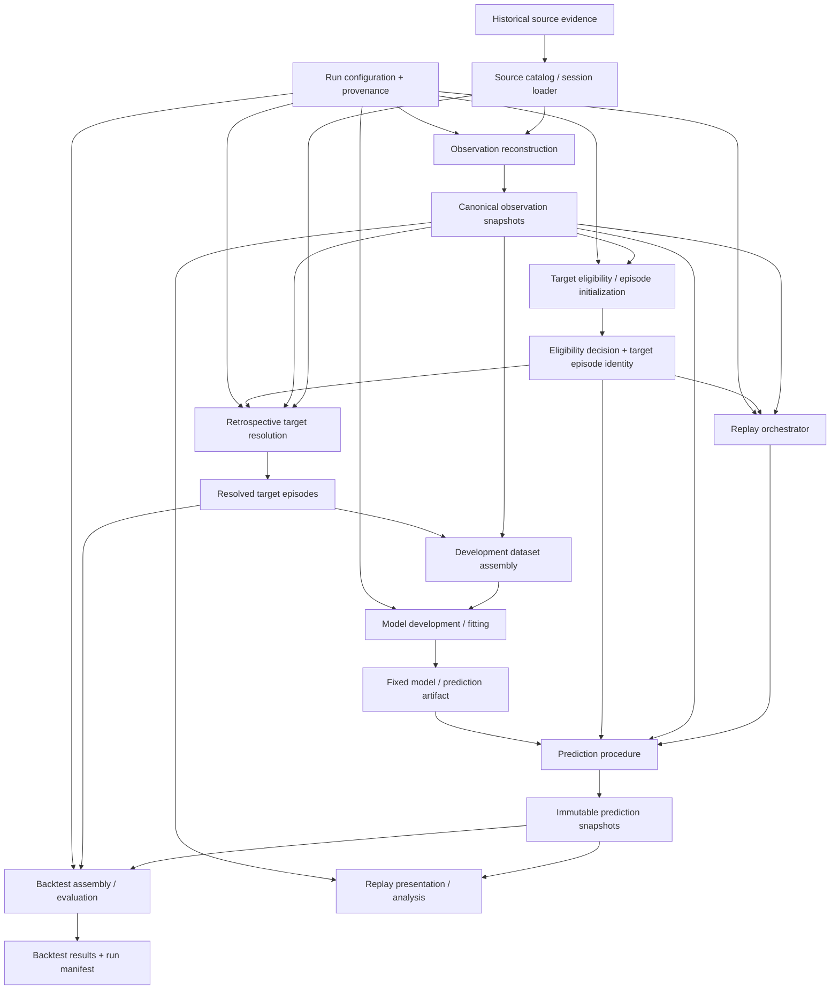

# V2 System Architecture Baseline

## Status

Approved — bounded re-review PASS recorded on PR #23 for head `dda048c0e89e0dec1eeecb94fbd6b34d10a057f4`.

## Abstraction level

Architecture — component boundaries, dependency direction, execution flow, artifact responsibilities, and reproducibility boundaries.

This artifact does not define provider-field reconstruction rules, exact data schemas, target-reconstruction algorithms, feature sets, model families, probability-region parameterization, metrics, production services, or live inference.

## Issue / branch

- Issue: #17 — `Architecture — define V2 system and data-flow baseline`
- Parent: #16
- Branch: `design/system-architecture-baseline`
- PR: #23

## Outcome

V2 will start as an **offline, replay-first modular Python system** built around immutable artifacts and explicit run provenance.

The architecture structurally separates three concerns:

1. a **prediction-time path** that reconstructs only what was legitimately knowable at a canonical observation instant;
2. a **target-owned causal episode-initialization boundary** that decides target eligibility and creates the target-episode identity from that as-of observation only; and
3. a **retrospective-truth path** that later resolves an already-initialized target episode from eventual race evidence.

Prediction execution consumes the causal episode initialization but never the retrospective target resolution. This gives target eligibility and episode identity one owner without allowing eventual pit truth into the forecast-time dependency closure.

Historical replay/backtesting orchestrates these boundaries. Retrospective target truth is never an input to observation reconstruction, eligibility/episode initialization, or prediction generation for the observation being forecast.

## Upstream semantic locks

This architecture consumes and does not redefine:

- `contexts/RACE_OBSERVATION_STATE.md` — canonical start/lap-completion checkpoints, prediction instant, availability-time information boundary, immutable as-of state, and race-wide time alignment;
- `contexts/PIT_EVENT_TARGET.md` — tyre-service-only qualifying event, pit-lane-entry occurrence anchor, first qualifying event strictly after prediction instant, target eligibility, target-episode lifecycle, terminal no-event, and truncation;
- `contexts/PREDICTION_OUTPUT_REPLAY.md` — complete remaining-target-scope probability distribution, explicit terminal no-event probability, derived pit-window summary, and immutable successive prediction snapshots;
- `contexts/EVALUATION_BACKTESTING.md` — one prediction-target pair as the atomic evaluation unit, leakage-safe replay/backtesting, repeated-within-race forecast identity, and separation between development evidence and final backtest evidence;
- `contexts/WAVE1_SEMANTIC_INTEGRATION.md` — the passing semantic integration gate and its later-phase handoffs;
- `decisions/2026-09-08-v2-project-direction.md` — predictive rather than prescriptive scope, replay/backtesting first, live inference later;
- `decisions/2026-09-08-v2-pit-event-scope.md` and `decisions/2026-09-09-v2-prediction-output-semantics.md`.

## Repository baseline

The current repository is primarily a thesis-era research repository: historical race CSV files under `data/` plus Jupyter notebooks for collection, EDA, feature work, model training, reporting, and strategy experiments. There is no V2 reusable package, run boundary, or canonical artifact/provenance layer yet.

V2 therefore should not begin by turning existing notebooks into a production service. Existing notebooks and CSVs remain evidence and exploratory inputs. The first implementation architecture should make the canonical semantics executable in reusable modules, then let notebooks call those modules for analysis and visualization.

## Architectural drivers

The initial architecture is driven by these constraints:

1. **Point-in-time causality is structural.** Future race truth must not enter a prediction accidentally.
2. **Target eligibility has one owner.** Prediction/replay must not reimplement target-owned eligibility or infer it from eventual event truth.
3. **Replay is the first runtime.** The initial system executes historical sessions chronologically; it is not a live event platform.
4. **Predictions are immutable historical objects.** Rerunning later code produces a new run, not a rewritten earlier forecast.
5. **Target resolution is retrospective truth.** It may use eventual evidence but is isolated from the forecast-time path.
6. **One eligible observation opens one target episode.** Successive observations stay distinct even when they later resolve to the same eventual pit event.
7. **Reproducibility is explicit.** Important state is carried by artifacts and run manifests, not hidden in notebook cells or process memory.
8. **Detailed choices remain owned by bounded follow-on design.** The architecture supplies stable seams for #18–#21 rather than pre-solving them here.

## Architecture style

### Initial style: modular package + batch orchestration

The initial V2 system should be implemented as one installable Python package with strict internal module boundaries, invoked by a small command-line/batch orchestration layer. Notebooks are consumers of that package, not owners of canonical logic.

This is intentionally simpler than a service-oriented architecture. The initial workload is historical reconstruction, model development, deterministic replay, and backtesting in one research repository. Databases, message brokers, web services, background workers, and distributed runtime components do not solve a current requirement.

Logical boundaries are nevertheless explicit so a later live extension can replace the source/orchestration edge without changing the canonical observation, target-initialization, prediction, or artifact contracts.

### Persistence style: immutable file artifacts

The architecture requires immutable, run-addressable persisted artifacts and manifests. It does not require a database for the initial core.

Exact serialization formats, column types, directory naming, and partitioning are owned by the detailed design slices. Implementations may use tabular or structured files appropriate to each artifact, provided artifact identity, version, immutability, and provenance requirements below are preserved.

## End-to-end data flow



The diagram has three controlled joins/boundaries:

- **Eligibility / episode initialization** consumes the canonical as-of observation only. It may decide that an observation is target-ineligible or, when eligible, create the target-episode identity. It may not inspect eventual pit occurrence, terminal outcome, or retrospective target truth.
- Observation and resolved target artifacts may be joined for **development/training** only under the declared development temporal boundary.
- Prediction and resolved target artifacts may be joined for **evaluation** only after the prediction snapshot is fixed.

The explicit `Canonical observation snapshots -> Retrospective target resolution` edge records the per-observation target contract. There is no resolved-target-to-observation, resolved-target-to-episode-initialization, or resolved-target-to-prediction edge in the forecast execution path.

## Logical components and responsibilities

### 1. Source catalog / session loader

**Owns:** locating and loading the historical evidence selected for one declared reconstruction run, plus source-level identity/checksum/version references.

**Provides:** source evidence to observation reconstruction and retrospective target resolution.

**Does not own:** semantic interpretation of availability time, target eligibility, pit qualification, target outcome, model features, or evaluation.

The loader must expose source evidence without silently converting final historical records into prediction-time facts.

Detailed provider/source behavior belongs to #18 and #19.

### 2. Shared identity and provenance primitives

**Owns:** cross-component technical identity/value concepts that must be referenced consistently, such as race-session identity, driver-entry identity, checkpoint/prediction-instant reference, artifact identity, run identity, and version/provenance references.

**Provides:** stable identifiers and provenance references used by all artifact contracts.

**Does not own:** domain semantics already assigned to the Wave 1 slices or the exact storage schema selected later.

This shared layer contains no feature logic and no target-dependent convenience decisions.

### 3. Observation reconstruction

**Owns:** creating canonical driver-specific point-in-time observation snapshots from historical source evidence under the approved availability-time boundary.

**Input:** source evidence + reconstruction configuration.

**Output:** immutable canonical observation snapshots plus reconstruction/provenance status.

**Hard boundary:** this component must not consume target eligibility decisions, target episodes, eventual pit-event qualification, final prediction outcomes, or later race truth unless that information is independently proven to have been available by the observation prediction instant.

Detailed reconstruction rules, source ordering, ambiguity policy, technical identities, and observation representation belong to #18.

### 4. Target subsystem

The target subsystem is the single architecture owner of technical target eligibility, target-episode identity, and retrospective target resolution. Its detailed technical design belongs to #19. It exposes two distinct boundaries because they have different causal permissions.

#### 4a. Target eligibility / episode initialization

**Owns:** applying the approved target-eligibility contract to one canonical as-of observation and, when eligible, creating the target-episode identity opened at that observation's prediction instant.

**Input:** one canonical observation + target-semantics/design version/configuration that does not contain retrospective outcome truth.

**Output:** an immutable eligibility decision; for an eligible observation, it also supplies the immutable target-episode identity/reference required by prediction and later target resolution.

**Hard boundary:** it consumes no retrospective source evidence, eventual pit-event identity, future tyre-service qualification, terminal target outcome, or evaluation result. Eligibility cannot be inferred from whether a future pit actually occurred.

Prediction and replay consume this boundary; they do not reimplement its rules.

#19 owns the exact eligibility materialization rules, identity construction, and technical representation.

#### 4b. Retrospective target resolution

**Owns:** resolving an already-initialized target episode using eventual race evidence under the approved pit-event/target semantics.

**Input:** canonical observation identity/boundary + eligible target-episode identity + retrospective source evidence + target-reconstruction configuration.

**Output:** an immutable target-resolution artifact representing observed event, terminal no-event, or truncated/indeterminate follow-up as later defined by #19.

**Hard boundary:** it does not decide forecast-time eligibility, create a replacement episode identity, or mutate the observation/episode-initialization artifact. Event qualification may use eventual race truth only for retrospective resolution.

Detailed pit-visit identity, tyre-service qualification, terminal-boundary reconstruction, truncation handling, and target-resolution representation belong to #19.

### 5. Development dataset assembly

**Owns:** joining approved observation-derived predictor inputs with resolved target episodes for model development under an explicitly declared development/training population and temporal boundary.

**Input:** immutable observation artifacts, target-episode initialization references, immutable resolved/accounted target artifacts, and development-run configuration.

**Output:** a reproducible model-development dataset/view plus provenance linking back to its source artifacts.

**Hard boundary:** this component is not used to generate a forecast for an evaluation observation. It cannot make retrospective target truth available through the prediction procedure's runtime input interface.

Feature selection, transformations, sampling, model family, and statistical choices remain later experimentation/verification work unless a later design issue explicitly owns them.

### 6. Prediction procedure

**Owns:** creating one canonical immutable prediction snapshot from one legitimate observation, one target-owned eligible episode initialization, and one fixed model/prediction artifact.

**Input:** one canonical observation, its eligible target-episode identity/reference, a fixed model/prediction artifact, and prediction configuration permitted by the approved semantics.

**Output:** one immutable complete next-pit probability prediction snapshot attached to that observation and target-episode identity.

**Forbidden input:** retrospective target resolution, eventual pit-event identity, future race facts, or evaluation result.

The prediction procedure does not decide target eligibility or create target-episode identity. If the target subsystem marks an observation ineligible, replay does not call the prediction procedure for an ordinary V2 next-pit forecast.

The prediction procedure is the **sole creator of prediction snapshots**. Replay invokes it and records the returned snapshot identity in its run manifest; replay does not independently create or rewrite prediction snapshots.

The exact timing-region representation, normalization invariants, model-facing interface, model artifact contract, and pit-window derivation belong to #20.

### 7. Model development / fitting

**Owns:** producing a versioned model/prediction artifact from development evidence permitted by a declared temporal development boundary.

**Input:** development dataset/view + model-development configuration.

**Output:** immutable model/prediction artifact with provenance sufficient to establish which historical evidence and configuration could influence it.

Training can see historical targets from its allowed development set; forecast execution for a given observation cannot.

Exact estimator family, features, loss, tuning, and calibration remain outside #17.

### 8. Replay orchestrator

**Owns:** deterministic chronological execution over canonical observations for a declared historical session/run, consuming the target subsystem's eligibility/episode-initialization decisions, invoking the fixed prediction procedure only for eligible episodes, and recording every created prediction snapshot in the replay manifest.

**Input:** ordered canonical observation artifacts, matching causal eligibility/episode-initialization artifacts, a fixed model/prediction artifact, replay configuration, and run provenance.

**Output:** a replay run manifest/reference set identifying the prediction snapshots created by the prediction procedure.

The orchestrator coordinates; it does not decide target eligibility, create target-episode identities, resolve target truth, create prediction contents, choose model features, or score predictions.

Detailed replay ordering, run metadata, and execution contract belong to #21.

### 9. Backtest assembly / evaluation boundary

**Owns:** joining already-fixed prediction snapshots to the resolved target episodes that retrospectively resolve the same initialized target episodes, forming canonical per-prediction-target evaluation units and passing them to later metric/statistical evaluation logic.

**Input:** immutable prediction snapshots, immutable target-resolution artifacts, and declared backtest protocol/run configuration.

**Output:** evaluation units, accounting summaries, and versioned backtest result artifacts.

**Hard boundary:** no target or evaluation result may flow backward to change the predictions being evaluated. If evaluation causes the prediction-producing procedure to change, a later run must use a new model/procedure/run identity and new final-evaluation evidence under the approved temporal rules.

Detailed temporal development/evaluation mechanics and accounting belong to #21. Exact scoring/statistical estimators remain verification/statistical-design work.

### 10. Replay presentation / notebooks

**Owns:** human-facing exploration, plots, diagnostics, and replay presentation built from canonical artifacts.

**Input:** observation, prediction, target, and result artifacts as appropriate to the analysis being shown.

**Does not own:** canonical reconstruction, target eligibility/episode initialization, target resolution, prediction, or evaluation logic.

Existing thesis-era notebooks remain historical evidence. New or revised notebooks may consume V2 modules, but a result is not reproducible merely because a notebook once produced it.

## Dependency rules

The implementation must preserve the following directional rules even if physical modules are later reorganized:

1. Shared identity/provenance primitives may be imported by all V2 modules but must not depend on reconstruction, target, prediction, or evaluation modules.
2. Observation reconstruction may depend on source loading and shared primitives only; it must not depend on target initialization/resolution, model-development, prediction, or evaluation modules.
3. Target eligibility / episode initialization may consume the canonical observation and shared target configuration only. It must not consume retrospective target evidence or resolution.
4. Retrospective target resolution may consume the canonical observation boundary, the already-created eligible episode identity, source evidence, and shared primitives. It must not mutate observation or initialization artifacts.
5. Prediction execution may consume the canonical observation, the target-owned eligible episode initialization, and a fixed model/prediction artifact. It must not import or query retrospective target resolution for the observation being forecast.
6. Replay may consume the target-owned causal eligibility/episode-initialization contract so it knows whether an ordinary V2 prediction is defined and which episode identity to attach. Replay must not duplicate those rules.
7. Development assembly is the explicit controlled join where historical observation inputs and allowed resolved training targets meet.
8. Backtest assembly is the explicit controlled join where immutable predictions and retrospective target resolutions meet.
9. Replay orchestration coordinates prediction execution but must not become a hidden observation, target-resolution, feature, or scoring layer.
10. Presentation/notebook code may depend on public V2 interfaces; canonical V2 modules must not depend on notebooks.
11. No architecture component may reinterpret a high pit probability as an optimal strategy recommendation.

The forecast-time dependency closure may contain the **target eligibility / episode-initialization interface** because that interface is causal and target-owned. It must exclude **retrospective target resolution** and evaluation. This is the structural rule that prevents the target-ownership inversion identified in the first review while preserving point-in-time leakage safety.

## Artifact classes and ownership

The architecture requires the following logical persisted artifacts. Exact schemas and serialization are deferred.

| Artifact | Sole creator | Primary consumers | Mutability rule |
| --- | --- | --- | --- |
| Source evidence manifest | Source catalog / loader | Observation reconstruction, target resolution, audit | Immutable for a declared source snapshot/run |
| Canonical observation snapshot | Observation reconstruction | Target initialization, prediction, replay, development, target resolution, audit | Immutable as-of state |
| Eligibility decision / target-episode initialization | Target eligibility / episode initialization | Replay, prediction, target resolution, development, audit | Immutable; outcome truth is never backfilled into it |
| Target-resolution artifact | Retrospective target resolution | Development, backtest, audit | Immutable for a declared reconstruction/version; corrected reconstruction creates a new resolution artifact/version |
| Model / prediction artifact | Model development | Prediction, replay | Immutable version used by a run |
| Prediction snapshot | Prediction procedure | Replay manifest, replay presentation, backtest, audit | Immutable historical forecast |
| Replay run manifest | Replay orchestrator | Audit, presentation, backtest linkage | Immutable after run completion |
| Backtest run manifest/results | Backtest boundary/evaluator | Analysis, reporting, audit | Immutable after run completion |

“Immutable” means a historical artifact used by a declared run is not silently overwritten. Improved source reconstruction, code, target resolution, model, or configuration creates a new version/run with lineage to its predecessors.

## Provenance boundary

Every persisted V2 run/artifact must be traceable enough to answer, as applicable:

- which repository/code revision produced it;
- which approved semantic/design version it claims to implement;
- which source evidence snapshot(s) and source identity/version/checksum references were used;
- which observation reconstruction configuration/version produced an observation;
- which target eligibility/episode-initialization version produced the eligibility decision and episode identity;
- which retrospective target-resolution configuration/version produced a resolved target artifact;
- which model/prediction artifact and model-development provenance produced a prediction;
- which replay/backtest run configuration was active;
- which upstream artifact identities were consumed;
- which randomness controls affected a learned or stochastic result when relevant.

The exact manifest schema and hashing/version mechanism are later detailed-design/implementation choices. The architectural requirement is that provenance is persisted explicitly and is not inferred from notebook history, file modification time, or the current Git branch alone.

## Initial repository execution shape

A later implementation should converge toward an installable package structure similar to this logical shape:

```text
src/
  f1_pit_predictor/
    domain/          # shared identities and value contracts
    sources/         # source loading/catalog boundary
    observations/    # point-in-time reconstruction
    targets/         # causal eligibility/episode init + retrospective resolution
    prediction/      # stable forecast-time contract; sole prediction-snapshot creator
    development/     # controlled observation/resolved-target join and fitting boundary
    replay/          # chronological orchestration and replay manifest
    evaluation/      # prediction/resolved-target join and evaluation boundary
    provenance/      # run/artifact metadata primitives
    cli/             # thin batch entry points

notebooks/           # optional V2 analysis/presentation consumers
artifacts/           # generated run artifacts; storage/layout policy defined later
design/              # approved architecture/detailed-design records
```

This is a logical target, not an instruction in #17 to move legacy files or create production code. #17 fixes the package-oriented modular shape and dependency direction; exact package names, command names, file formats, and migration steps may be adjusted during implementation if the same boundaries are preserved.

## Primary execution flows

### A. Historical reconstruction

1. Select one historical source/session scope and record a source manifest.
2. Observation reconstruction produces canonical point-in-time observations independently of target truth.
3. The target subsystem applies its causal eligibility/episode-initialization boundary to each valid observation using only that as-of observation; eligible observations receive distinct target-episode identities.
4. Retrospective target resolution consumes the eligible episode identities, their canonical observation boundaries, and eventual source evidence to produce observed-event, terminal-no-event, or truncated/indeterminate resolution artifacts.
5. Persist observation, episode-initialization, and target-resolution artifacts with separate provenance.

#18 defines step 2. #19 defines the detailed technical contracts for steps 3–4.

### B. Model development

1. Select only development-period observations/resolved targets allowed by the declared temporal policy.
2. Assemble a development view through the explicit development join.
3. Fit/tune/calibrate under the later approved model-development protocol.
4. Freeze an immutable model/prediction artifact with provenance.

No final-evaluation outcome may influence the artifact later claimed to have predicted it.

### C. Historical replay

1. Select a fixed model/prediction artifact and replay configuration.
2. Read canonical observations in prediction-instant order together with their causal target eligibility/episode-initialization artifacts.
3. For an ineligible observation, record the ineligible state and do not create an ordinary next-pit prediction.
4. For an eligible observation, replay passes the observation and target-episode identity to the prediction procedure.
5. The prediction procedure alone creates the immutable prediction snapshot; replay records its artifact identity in the run manifest.
6. Advance to the next observation without rewriting earlier observations, episode identities, or predictions.

Retrospective target-resolution artifacts are not needed to produce this forecast stream.

### D. Historical backtest

1. Select a completed replay/prediction run and declared backtest protocol.
2. Join each immutable prediction snapshot to the retrospective resolution of its own target-episode identity.
3. Preserve observed-event, terminal no-event, ineligible, and truncated/accounting distinctions according to the approved contracts.
4. Produce evaluation units and later metric/statistical results.
5. Persist the result and complete run provenance as a new backtest artifact.

## Failure and indeterminacy boundaries

The architecture distinguishes domain outcomes from reconstruction/runtime failures:

- **Target-ineligible observation:** the target subsystem produces an ineligibility decision from the canonical as-of observation; no ordinary target episode/prediction is created.
- **Eligible/open target episode:** the target subsystem creates the episode identity causally at the observation boundary, before any retrospective outcome is consumed.
- **Observed-event resolution:** retrospective target resolution establishes the canonical next qualifying event for an eligible episode.
- **Terminal no-event resolution:** an eligible episode resolves with known race-bounded truth that no later qualifying event occurred; it is part of the prediction distribution/evaluation contract.
- **Truncated/indeterminate resolution:** retrospective evidence cannot establish an event or defensible terminal boundary; it remains an explicit reconstruction/evaluation accounting state.
- **Observation reconstruction failure/ambiguity:** the system cannot claim a valid canonical point-in-time observation under the later #18 policy; downstream eligibility/prediction/evaluation must not silently fabricate one.
- **Malformed prediction output:** the later #20 contract defines validation/invariants; invalid output is a prediction-run failure, not a race-behavior outcome.

These states must not be collapsed into a generic missing value or negative class.

## Live inference extension seam

Live inference is intentionally not designed here.

The architecture preserves only these seams:

- a future live source adapter may provide evidence through an interface compatible with the source/observation boundary;
- target eligibility/episode initialization is causally computable from the canonical as-of observation and therefore does not require historical target truth;
- the prediction procedure consumes only causal forecast-time contracts;
- prediction artifacts remain tied to explicit observation instants, episode identities, and versions.

A future live product would still need bounded decisions for provider behavior, intra-lap triggers if any, latency/runtime requirements, state persistence, failure handling, and product presentation. None of those is an initial V2 commitment.

## Decisions intentionally deferred to bounded follow-on work

| Question | Owner |
| --- | --- |
| Concrete provider fields, availability ordering, conservative same-time/correction rules, canonical observation representation | #18 — Observation reconstruction/provenance |
| Exact target-eligibility materialization, target-episode identity, pit-visit identity, tyre-service qualification evidence, pit-entry reconstruction, terminal/truncation representation | #19 — Target reconstruction/dataset contract |
| Exact timing-region partition, probability representation, prediction/model artifact interface, normalization invariants, pit-window derivation | #20 — Prediction distribution/model-facing contract |
| Replay run contract, temporal development/final-evaluation mechanics, cohort/accounting rules, repeated-forecast grouping/provenance | #21 — Replay/backtest execution contract |
| Cross-design compatibility | #22 — Architecture/design integration gate |
| Verification fixtures, exact metrics/scoring, statistical confidence/dependence procedures, empirical model comparison | Verification/statistical phase after #22 |
| Production code, packaging details, commands, dependency versions, CI, artifact file formats where not fixed by detailed design | Implementation phase after required design/verification gates |
| Live provider/runtime/UI/intra-lap extensions | Future bounded product/design work |

## Architecture acceptance mapping

- **End-to-end historical flow:** defined by the data-flow diagram and the four primary execution flows.
- **Leakage-safe dependency direction:** enforced by separate observation, causal target-initialization, retrospective target-resolution, development-join, prediction, and evaluation boundaries.
- **Single target owner:** #19 owns detailed eligibility/episode initialization and retrospective resolution; replay/prediction consume the causal target contract rather than duplicate it.
- **Artifact ownership/immutability:** each persisted artifact class has one sole creator; prediction snapshots are created only by the prediction procedure.
- **Reproducibility:** explicit run/artifact provenance is a required architectural property.
- **Notebook role:** notebooks are presentation/analysis consumers and cannot own canonical V2 logic.
- **Live boundary:** only extension seams are preserved; no live runtime is designed.
- **Later ownership:** detailed reconstruction/model/evaluation questions are routed to #18–#22.
- **Semantic preservation:** prediction remains next-pit behavior forecasting, not strategy recommendation or optimization.

## Product Owner decisions

None required by this architecture baseline or by the review rework. The causal target-initialization / retrospective-resolution split is a delegated technical boundary that implements the already-approved target eligibility and point-in-time semantics; it does not change what observations, targets, or predictions mean.

## Review record

### Full scoped review — FAIL, rework required

- PR: #23
- Review: `pullrequestreview-5165172364` / `PRR_kwDOJBBaD88AAAABM95GjA`
- Date: 2026-09-10
- Outcome: **FAIL — rework required**
- Findings:
  - Blocking: forecast-time target eligibility / episode initialization had no single leakage-safe owner.
  - Minor: the diagram omitted the observation-to-target linkage.
  - Minor: prediction-snapshot creation ownership was ambiguous between prediction and replay.
- Product Owner decision: none required.

### Rework

The architecture now:

1. gives the target subsystem a causal eligibility/episode-initialization boundary that consumes only the canonical as-of observation;
2. separates that causal boundary from retrospective target resolution;
3. makes replay/prediction consume the target-owned episode initialization rather than infer or duplicate eligibility;
4. adds explicit observation-to-target-initialization and observation-to-retrospective-resolution edges;
5. makes the prediction procedure the sole creator of prediction snapshots, with replay limited to orchestration and manifest references.

### Bounded re-review — PASS

- PR: #23
- Review: `pullrequestreview-5165408870` / `PRR_kwDOJBBaD88AAAABM-HiZg`
- Reviewer: independent bounded re-review recorded through the repository's connected GitHub account (`Nelson-Jnrnd`); GitHub therefore represents the submission as `COMMENT` rather than `APPROVE`.
- Date: 2026-09-10
- Reviewed head: `dda048c0e89e0dec1eeecb94fbd6b34d10a057f4`
- Outcome: **PASS** — no Blocking, Major, or Minor findings remain.
- Verified: all three prior findings are resolved, no regressions were identified, and the original Issue #17 acceptance criteria are satisfied at the declared architecture abstraction level.
- Product Owner decision: none required.
