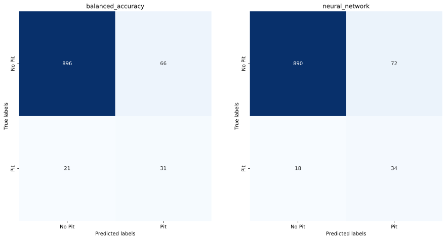
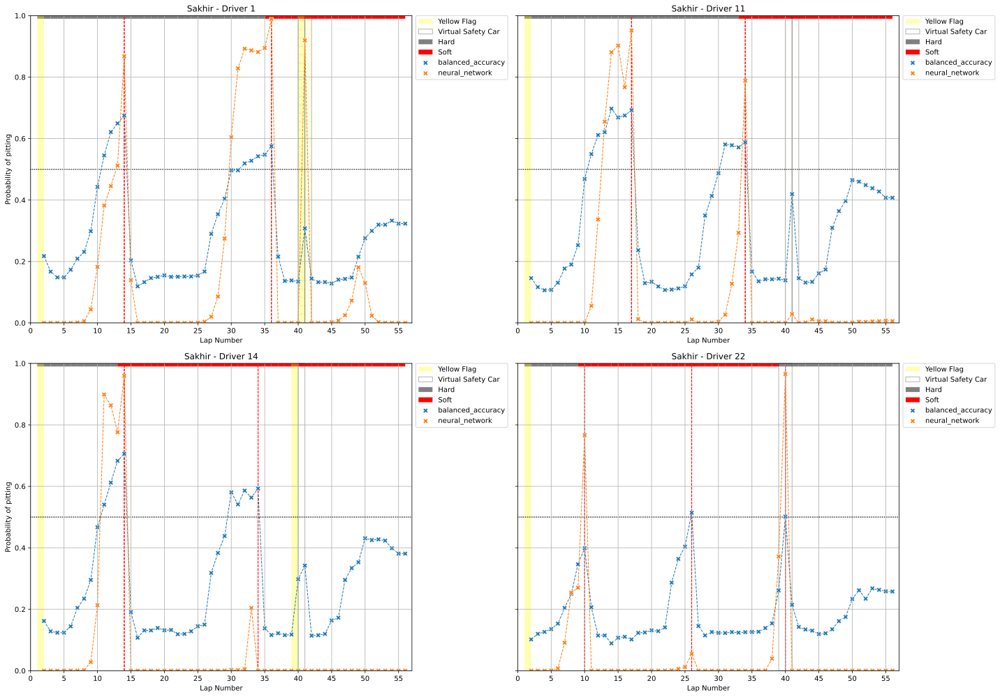
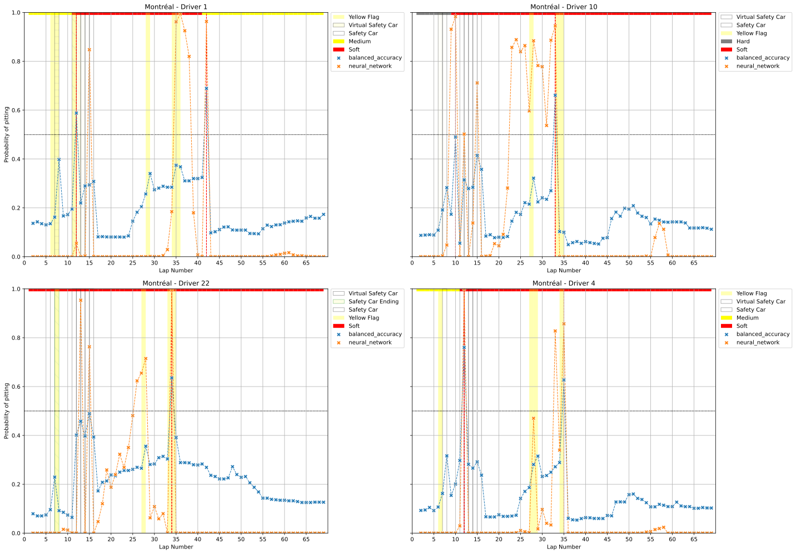
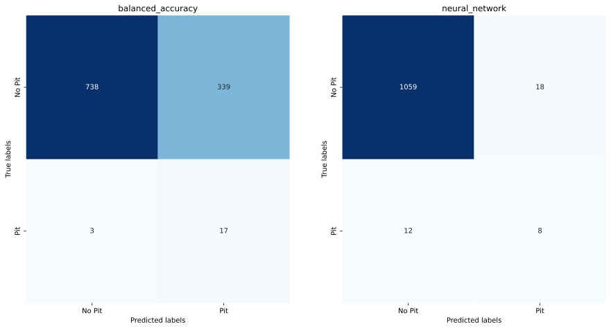
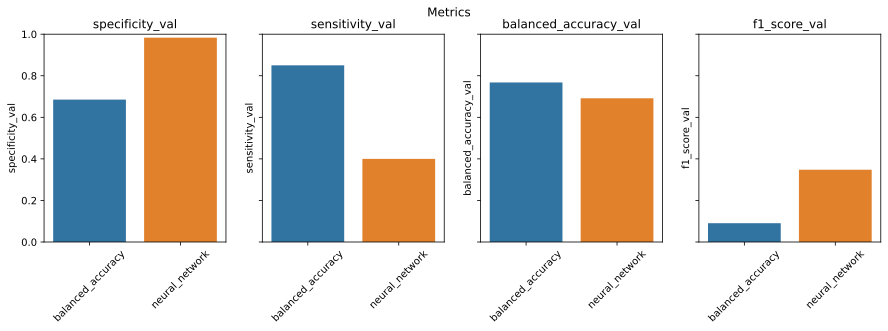
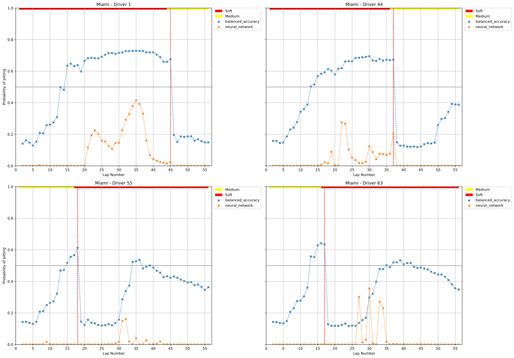
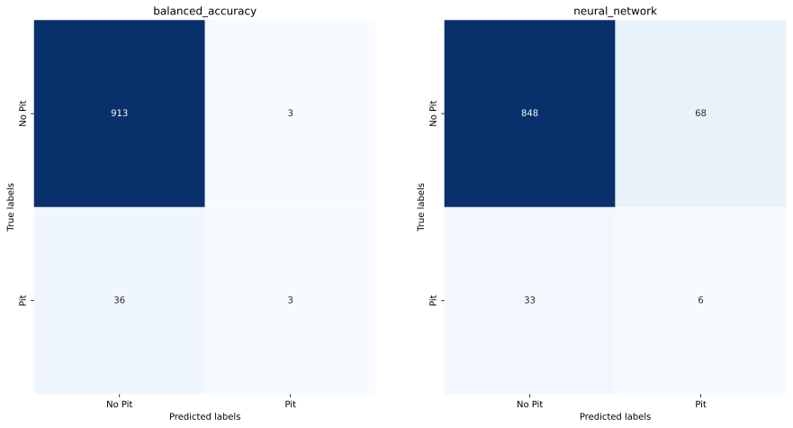

# Comparaison des modèles sensitivité, spécificité et équilibré

Pour mesurer l'interet de l'utilisation d'une métrique balanced accuracy pour l'entrainement des modèles, on compare les performances des modèles sur l'année 2023 comme set de validation (Monaco à été exclu car il a plut pendant la course).

## Comparaison des performances course par course
Pour chaque course de l'année 2023, on a mesuré la sensibilité, la spécificité, la balanced accuracy et le f1-score des modèles.

Ensuite on analyse la course de 4 pilotes pour comparer les performances des modèles plus en détail.

### Sakhir
Le grand prix de Bahrain dur 57 tours, il y a eu une période de virtual safety car du tour 40 au 42.

Les 3 modèles ont des bons scores de specificité se qui signifie qu'ils n'ont pas fait beaucoup de faux positifs.

En revanche, le model specificité a un score de sensibilité très faible, ont peut voir sur la matrice de confusion qu'il a raté 38 arrêts au stand (faux négatifs), le plus mauvais score des 3 modèles de loin.

Les performances du modèle sensible et celui du modèle équilibré sont assez proche mais le modèle équilibré a 40 faux positifs de moins que le modèle sensible sans perdre beaucoup de vrais positifs (2).

Premièrement, on peut observer que le modèle sensible à été perturbé par le drapeau jaune des 2 premiers tours. Sa probabilité d'arrêt au stand pendant cette période augmente fortement.

Ensuite, en étudiant la différence de comportement des modèles avant un arrêt au stand. On remarque que le modèle specifique augmente sa probabilité très rapidement, quasiment de manière exponentielle. Les autres ont une croissance plus lente et plus linéaire. Ce comportement est la cause de faux négatif comme pour le premier arrêt du pilote 11 et du pilote 1. Mais dans d'autre cas, cela permet au modèle specifique de faire moins de faux positifs comme pour le deuxième arrêt du pilote 1 du pilote 14.

Finalement, on peut regarder la réaction des modèles à la période de virtual safety car.
* Le modèle sensible a une réaction très forte et pour les 4 pilotes il prédit un arrêt au stand.
* Le modèle spécifique augmente sa probabilité que de 0.1 pour les 4 pilotes. Il ne prédit pas d'arrêt au stand.
* Le modèle équilibré augmente sa probabilité de 0.2 à 0.3 pour les 4 pilotes. Il est intéressant de voir que qu'il a parfaitement prédit les arrêt des 4 pilotes (Le pilote 22 s'arrête et pas les autres).

### Montréal
Le grand prix du Canada dur 70 tours, il y a eu une courte période de virtual safety car de 1 tour en début de course suivit d'une longue période de safety car du tour 11 au tour 16.

On retrouve le même comportement que pour le grand prix de Bahrein mais avec des scores plus élévés, particulièrement pour le modèle équilibré.

Cette course est intéressante car elle place les modèles dans une situation où une voiture de sécurité arrive tôt dans la course. On peut observer que le modèle sensible prédit une arrêt au stand pour les pilotes 1 et 4 pour la première période virtual safety car. On peut noter que les pilotes 1 et 4 sont en gomme médium comparés au autres.

De plus, en observant la course du pilote 10, qui s'est arrêté au stand entre les 2 périodes de safety car. Le modèle sensible re-suggère un arrêt pendant la deuxième période. Se qui est intéressant car cela serait un bon choix si il ne s'était pas déjà arrêté. On voit là peut-être une nécessité de prendre en compte plus d'un tour de course en compte.

### Miami
Le grand prix de Miami dur 57 tours, n'as pas eu de période de vsc, sc ou de drapeau jaune.

Les performances sont moins bonnes que pour les autres courses. Cela est peut-être du au fait qu'il est plus facile de prédire un arrêt au stand pendant une période de voiture de sécurité. On peut aussi observer que le modèle sensible à le meilleur f1-score.

Parmis les 4 courses observées, 2 des piltoes commencent par un cours relai en medium suivis d'un long en soft et les 2 autres font l'inverse.

Les modèles sembles tous suggérer un arrêt au stand autour du tour 15, peut-importe la gomme de pneu. Cela est peut-être du au fait que le modèle prend trop en compte l'age des pneus dans sa décision. Ou alors le circuit de miami est particulièrement peu exigeant pour les pneus.

### Melbourne
Le grand prix d'Australie dur 58 tours, il y a eu une courte période de virtual safety car de 1 tour en début de course suivit d'une longue période de safety car du tour 11 au tour 16.

