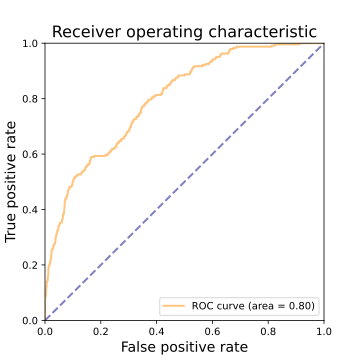
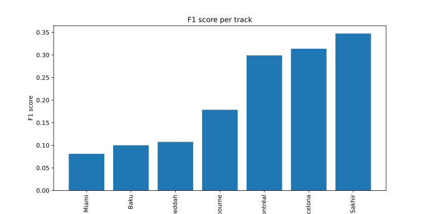
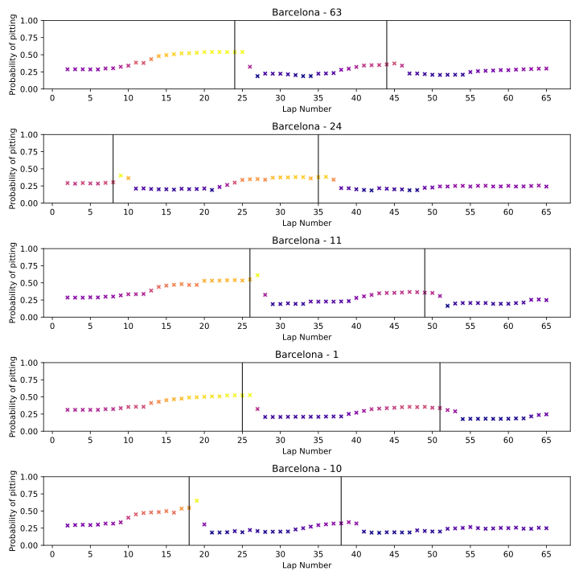
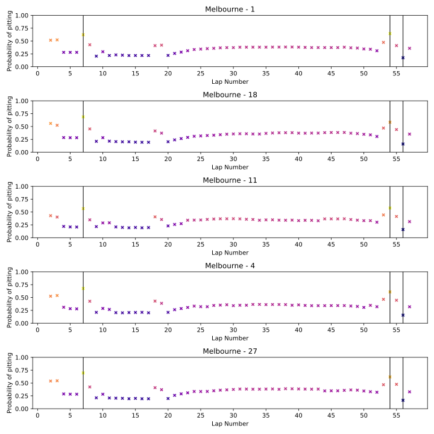
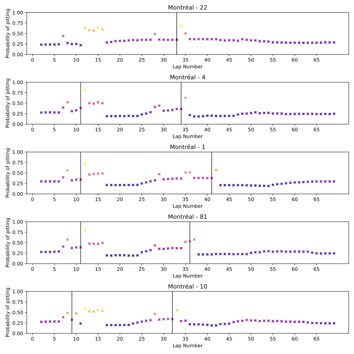
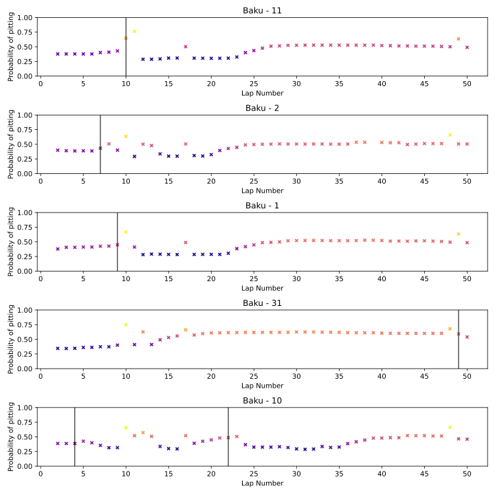
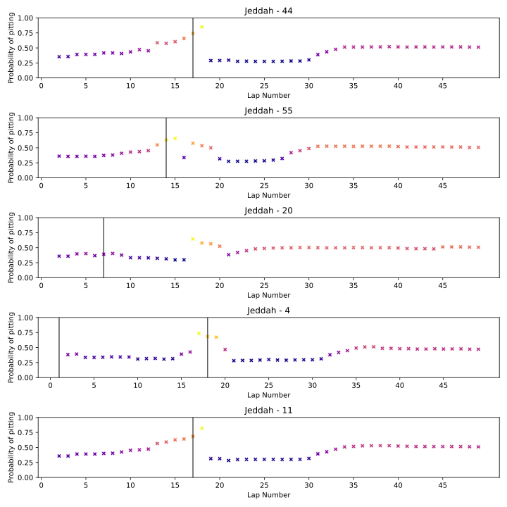
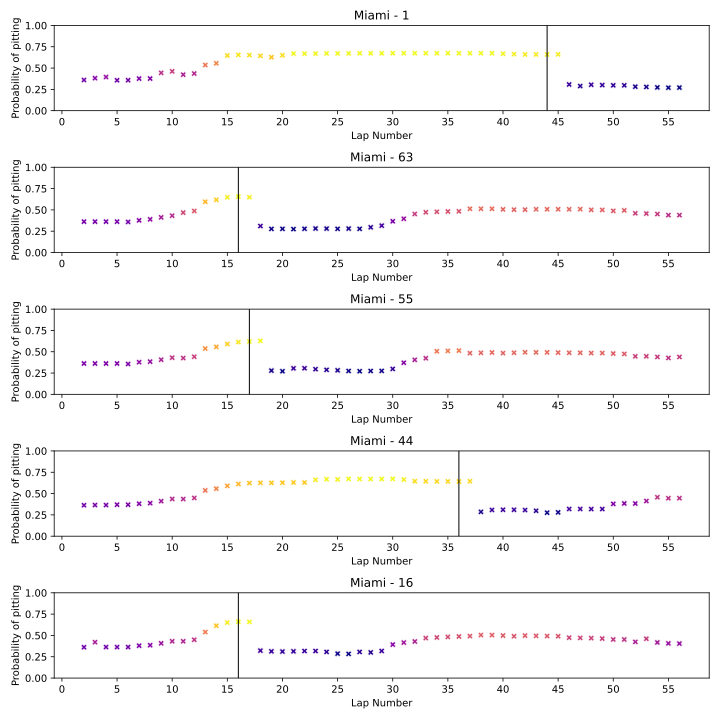
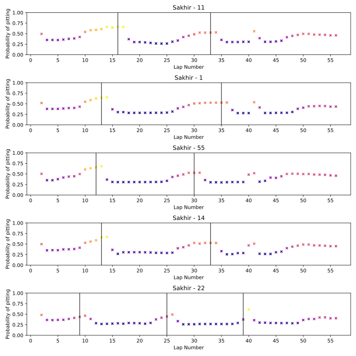

#Sensitivity model
Le modèle optimisé avec le score de sensitivité devrait prendre plus de risque. Il essaie de prédire le plus de vrais positifs possible au détriment des faux négatifs. On devrait voir plus de prédictions positives.

Modèle RandomForestClassifier avec les paramètres suivants :
```python
...
```

Trouvé avec GridSearchCV sur les paramètres suivants :
```python
param_grid = {
    'n_estimators': [100, 200, 300],
    'max_depth': [5, 10, 20],
    'min_samples_split': [2, 5, 10],
    'min_samples_leaf': [1, 2, 5],
    'class_weight': ['balanced_subsample']
}
```

Résultats sur le jeu de données de test :
```python
...
```
Résultats sur le jeu de données de validation (7 courses de 2023):
```python
[[5815 1380]
 [  98  143]]
              precision    recall  f1-score   support

       False       0.98      0.81      0.89      7195
        True       0.09      0.59      0.16       241

    accuracy                           0.80      7436
   macro avg       0.54      0.70      0.52      7436
weighted avg       0.95      0.80      0.86      7436
```
On observe plus de faux positifs mais pas beaucoup plus de vrais positifs par rapport au modèle specifique.
## ROC curve

## Performance course par course

Les performances sont en général moins bonne avec un maximum de 0.35 pour le circuit de Sakhir. Il n'y a pas de course où le F1-score est nul mais il reste très faible.

### Barcelone

### Melbourne

### Montreal

### Baku

### Jeddah

### Miami

### Sakhir
