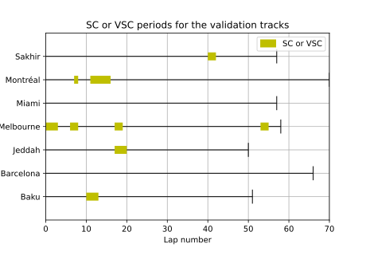

#Sensitivity model
Modèle RandomForestClassifier avec les paramètres suivants :
```python
...
```

Trouvé avec GridSearchCV sur les paramètres suivants :
```python
param_grid = {
    'n_estimators': [100, 200, 300],
    'max_depth': [5, 10, 20],
    'min_samples_split': [2, 5, 10],
    'min_samples_leaf': [1, 2, 5],
    'class_weight': ['balanced_subsample']
}
```

Résultats sur le jeu de données de test :
```python
...
```
Résultats sur le jeu de données de validation (7 courses de 2023):
```python
[[5815 1380]
 [  98  143]]
              precision    recall  f1-score   support

       False       0.98      0.81      0.89      7195
        True       0.09      0.59      0.16       241

    accuracy                           0.80      7436
   macro avg       0.54      0.70      0.52      7436
weighted avg       0.95      0.80      0.86      7436
```

On observe que les performances sont similaire sur le jeu de données de test et de validation. On peut donc conclure que le modèle ne souffre pas d'overfitting.
## ROC curve

## Performance course par course

On peut voir que les performances sont très variables d'une course à l'autre. Parce que les courses n'ont pas la même difficulté...

### Barcelone

### Melbourne

### Montreal

### Baku

### Jeddah

### Miami

### Sakhir
