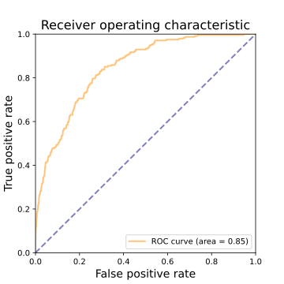
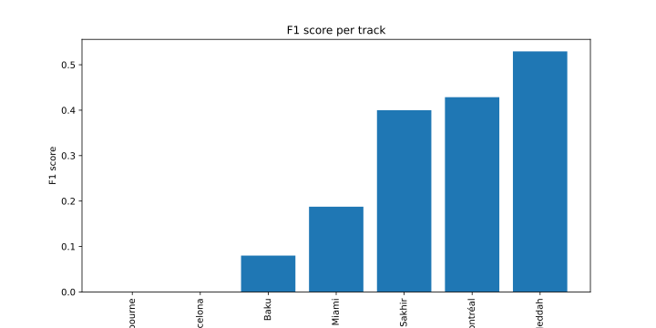
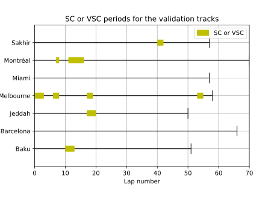
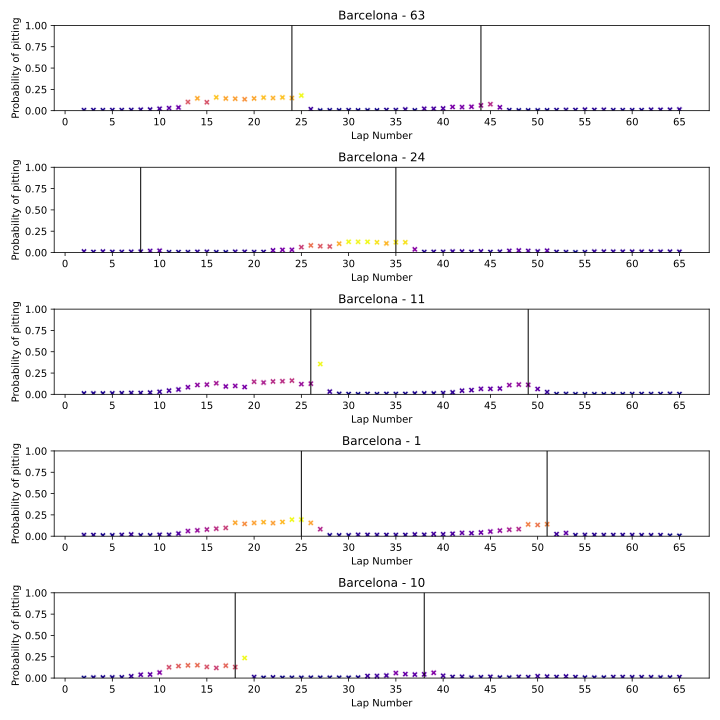
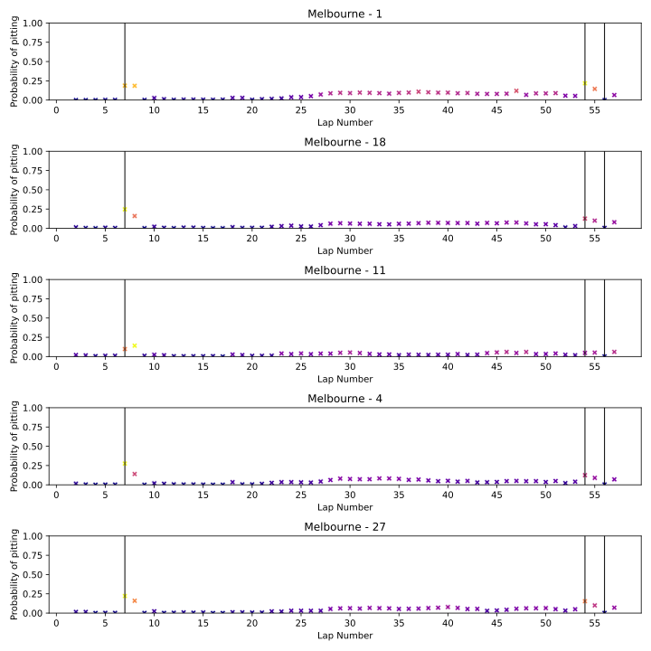
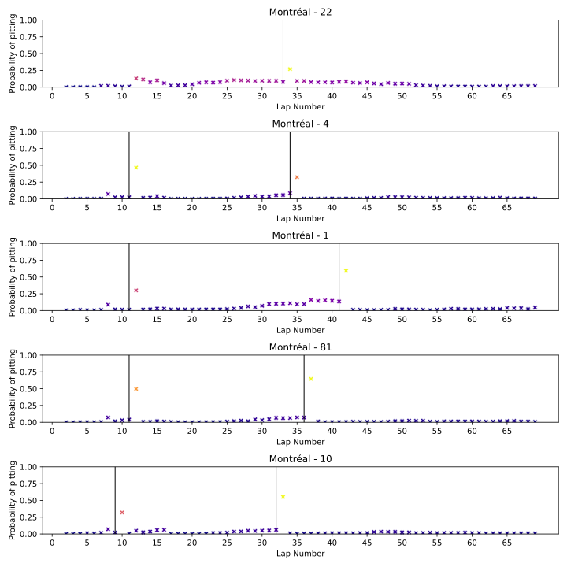
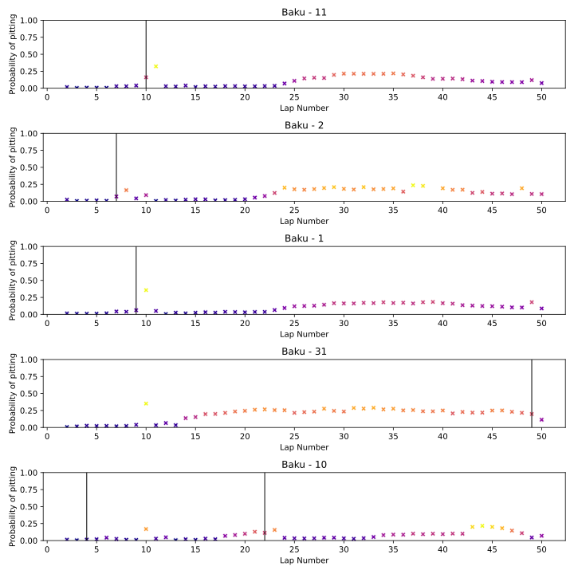
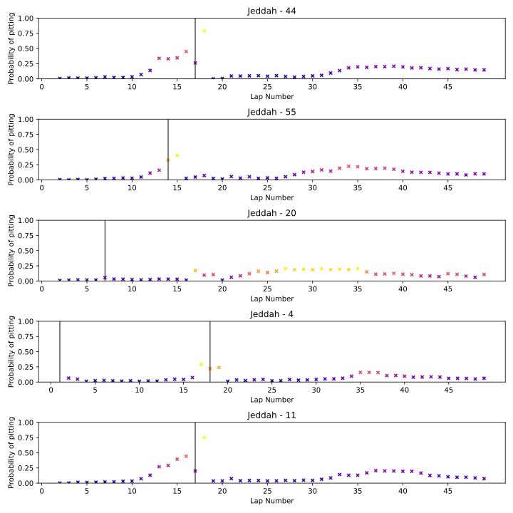
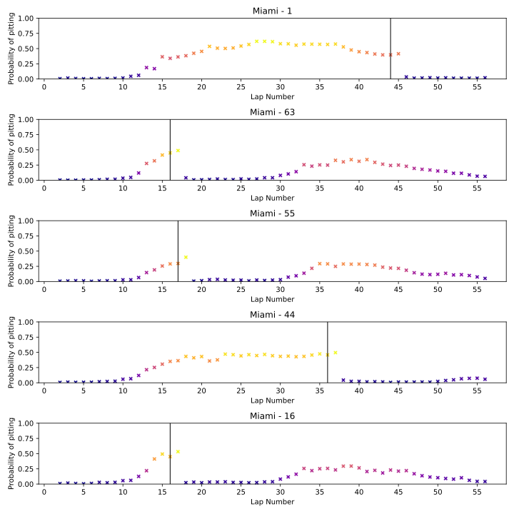
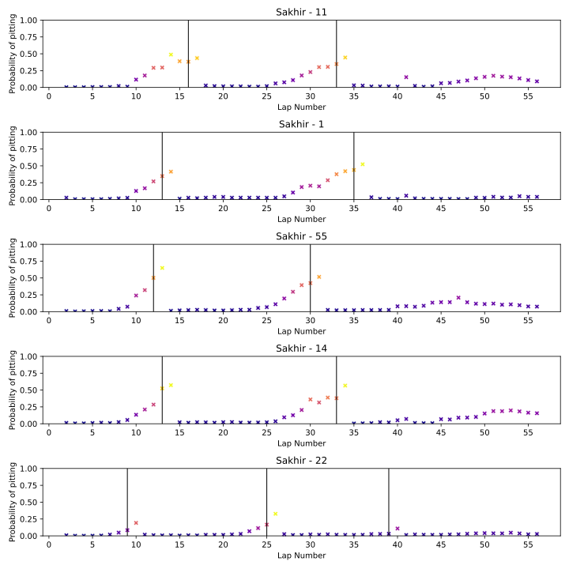

#Specificity model

Le modèle optimisé avec le score de spécificité devrait être plus "peureux" que les autres. Il essaie d'éviter les faux positifs au détriment des faux négatifs. On devrait voir moins de prédictions positives.

Concrètement, quand le modèle prédit une entrée au stand, on peut être assez certains qu'elle est vraie. Cependant le modèle va rater des entrées au stand.
## Paramètres
Modèle RandomForestClassifier avec les paramètres suivants :
```python
score : 0.9946937753329715
params : {'class_weight': 'balanced_subsample', 'max_depth': 20, 'min_samples_leaf': 1, 'min_samples_split': 2, 'n_estimators': 200}
```

Trouvé avec GridSearchCV sur les paramètres suivants :
```python
param_grid = {
    'n_estimators': [100, 200, 300],
    'max_depth': [5, 10, 20],
    'min_samples_split': [2, 5, 10],
    'min_samples_leaf': [1, 2, 5],
    'class_weight': ['balanced_subsample']
}
```

Résultats sur le jeu de données de test :
```python
[[15650   157]
 [  357   135]]
              precision    recall  f1-score   support

       False       0.98      0.99      0.98     15807
        True       0.46      0.27      0.34       492

    accuracy                           0.97     16299
   macro avg       0.72      0.63      0.66     16299
weighted avg       0.96      0.97      0.96     16299
```
Résultats sur le jeu de données de validation (7 courses de 2023):
```python
[[7150   45]
 [ 201   40]]
              precision    recall  f1-score   support

       False       0.97      0.99      0.98      7195
        True       0.47      0.17      0.25       241

    accuracy                           0.97      7436
   macro avg       0.72      0.58      0.61      7436
weighted avg       0.96      0.97      0.96      7436
```

On observe que les performances sont similaire sur le jeu de données de test et de validation. On peut donc conclure que le modèle ne souffre pas d'overfitting.
## ROC curve

## Performance course par course

On peut voir que les performances sont très variables d'une course à l'autre. Parce que les courses n'ont pas la même difficulté...

Les courses, Melbourne et Barcelone ont des performances nulles.

### Barcelone

On observe que le modèle n'arrive pas a augmenter la prédiction de la probabilité d'entrée au stand assez rapidement. Il est trop "peureux". C'est une course assez particulière car il n'y a pas de période d'arrêt.
### Melbourne

Melbourne est similaire à Barcelone, le modèle n'augmente jamais la probabilité d'entrée au stand. Il y a une période d'arrêt au début de la course mais le modèle est trop "peureux" et la probabilité ne dépasse pas les 50%
### Montreal

### Baku

### Jeddah

Jeddah est la course avec les meilleurs résultats du model (qui reste en dessous de 50% de f1-score). On peut voir que le modèle prédit une augmentation graduelle de la probabilité d'entrée au stand jusqu'au tour 14-15 environ. Une période de safety car au tour 17 pousse le modèle à prédire une entrée au stand.

Ensuite la spécificité du modèle l'aide à ne pas prédire d'arrêt au stand après.
### Miami

Miami est un autre cas de figure interéssant, il n'y a pas de périodes d'arrêt comme Barcelone, mais ici le modèle est capable d'augmenter la prédiction de la probabilité d'entrée au stand assez rapidement. On peut supposer que la dégradation des pneus est plus importante à Miami qu'à Barcelone. Ou alors cela peut être dû au fait que Miami est un circuit nouveau.

---
Il est intéressant de remarquer que les prédictions d'arrêt semble monter se stabiliser pendant une dizaine de tours avant de rédescendre.
### Sakhir


## Conclusion
Le modèle de spécificité est intéressant car il permet de prédire des entrées au stand avec une certaine confiance. Cependant il est trop "peureux" et ne prédit pas assez d'entrées au stand. Il est donc difficile de l'utiliser pour prédire les stratégies des équipes.

Sur certaines courses, le modèle est inutilisable car il ne prédit pas d'entrée au stand. Mon hypothèse est que ses courses sont celles avec une faible dégradation des pneus.

En revanche, le modèle fonctionne plutôt bien pour d'autres courses.